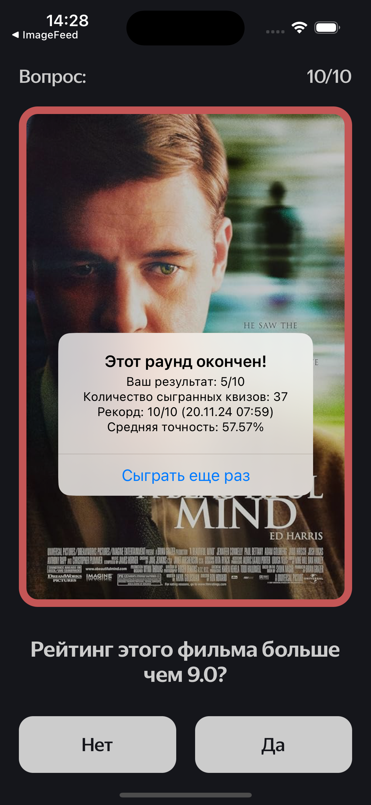

## **MovieQuiz**

**MovieQuiz** - is an app featuring quizzes about films from the IMDb Top 250 and the most popular movies.

## **Preview**

  
  

---

## **Links**

[Figma Design](https://www.figma.com/file/l0IMG3Eys35fUrbvArtwsR/YP-Quiz?node-id=34%3A243)

[API IMDb](https://tv-api.com/api#Top250Movies-header)

[Fonts](https://code.s3.yandex.net/Mobile/iOS/Fonts/MovieQuizFonts.zip)

## **App Description**

A single-page application with quizzes about films from the IMDb Top 250 and the most popular movies. The user answers questions about movie ratings. After each round, the app displays statistics on the number of correct answers and the user's best results. The goal is to answer all 10 questions in a round correctly.

## **Functional Requirements**

- **Splash Screen:**  
  Displays when the app launches.

- **Question Screen:**  
  After the splash screen, a question screen appears with the question text, an image, and two answer options: "Yes" and "No" (only one is correct).

- **Question Format:**  
  Each quiz question is based on the IMDb rating of a movie on a 10-point scale. For example: "Is this movie's rating higher than 6?"

- **Answer Feedback:**  
  When the user selects an answer, feedback is given indicating whether it is correct. The image border changes color accordingly.

- **Automatic Transition:**  
  After selecting an answer, the next question automatically appears after 1 second.

- **Round Completion:**  
  After 10 questions, an alert displays user statistics and an option to play again.

- **Statistics Include:**
  - Current round results (number of correct answers out of 10)
  - Number of quizzes played
  - Best score (highest result during the session, including date and time)
  - Overall quiz accuracy (percentage of correct answers)

- **Replay Option:**  
  Users can start a new round by clicking the "Play Again" button in the alert.

- **Error Handling:**  
  If data cannot be loaded, an alert appears with a message that something went wrong and a button to retry the network request.

## **Technical Requirements**

- **Device Support:**  
  Supports iPhone devices running iOS 15; portrait mode only.

- **UI Adaptation:**  
  Interface elements are adapted for iPhone screen resolutions starting from iPhone X. Layouts for iPhone SE and iPad are not provided.

- **Design Consistency:**  
  Screens match the design specifications — correct fonts, sizes, positioning, button dimensions, and margins as specified in the Figma design.
